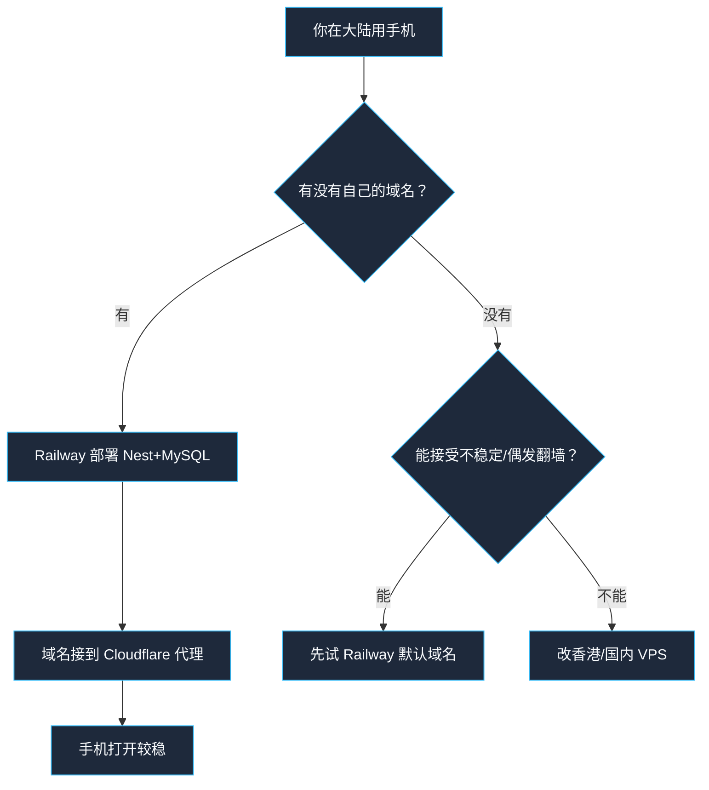
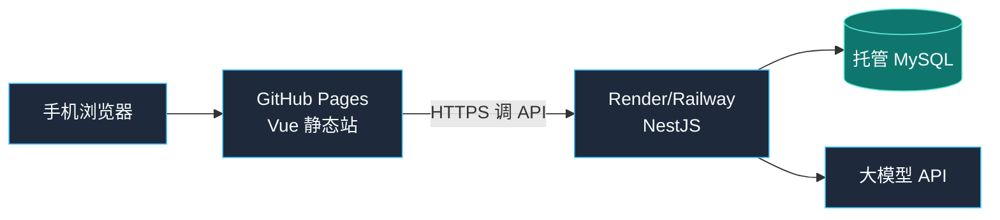

# 手机随时能打开：部署方案

## 先说结论

**GitHub 可以部署前端页面，但不能单独跑完整项目。**

### 大陆用户：Railway 还是 Render？

| 对比项 | Railway | Render |
|--------|---------|--------|
| Nest + MySQL 一起上 | ✅ 很方便（插件式 MySQL） | ⚠️ 免费档数据库弱，常要外挂 DB |
| 免费体验 | 新用户试用额度；之后偏按量/订阅 | 有免费 Web，但会**休眠** |
| 默认域名国内直连 | `*.up.railway.app` **经常打不开/不稳** | `*.onrender.com` **也常被干扰** |
| 控制台/部署 | 多数时候可访问（网络好时） | 多数时候可访问 |
| 适合大陆「随时打开」 | 需 **自定义域名 + Cloudflare** | 同样需要；还要忍受冷启动 |

**推荐（大陆个人自用）：选 Railway + Cloudflare 自定义域名。**

原因很简单：

1. 你这个项目正好是 **Nest + MySQL**，Railway 一条龙更省事  
2. Render 免费实例休眠，手机第一次打开可能卡十几秒  
3. 两边的**默认域名在大陆都不保证直连**；真正决定能不能打开的是「有没有自己的域名走 Cloudflare」  
4. 若完全不想买域名、又要求大陆无代理稳定访问 → 海外托管都不理想，应考虑**香港/国内轻量云**



> 说明：网络环境会变，上线后请用**手机流量 + 家里 Wi‑Fi**各测一次；测不通再上 Cloudflare 域名。

| 部分 | GitHub 能不能扛 | 推荐做法 |
|------|-----------------|----------|
| Vue 前端 | ✅ 可以（GitHub Pages） | 本仓库已配好 Actions |
| NestJS 后端 | ❌ 不能常驻运行 | Render / Railway / Fly.io |
| MySQL | ❌ GitHub 不提供数据库 | 跟后端一起用托管 MySQL |

所以手机要「随时打开」，最少需要：

1. **前端网址**（GitHub Pages，免费）
2. **后端 API 网址**（另外部署，免费档通常够用）



最终你手机收藏的地址类似：

`https://quanchenlc.github.io/daily-recipe/`

---

## 方案 A（推荐）：GitHub Pages 前端 + Render 后端

适合个人项目、免费起步。

### A1. 部署后端（Render / Railway 示例）

仓库根目录有可选蓝图 `render.yaml`（若平台无免费 MySQL，可把数据库放到 Railway，只把 Nest 放 Render）。

**更省事的一条龙：Railway**

1. 注册 [Railway](https://railway.app)
2. New Project → Deploy from GitHub → 选本仓库
3. 添加 **MySQL** 插件，再添加 **GitHub Repo** 服务，Root Directory 设为 `backend`
4. Build/Start：`npm install && npm run build` / `npm run start:prod`
5. 把 MySQL 变量映射到 `DB_HOST/PORT/USER/PASSWORD/NAME`

**或 Render Web Service**

1. 注册 [Render](https://render.com)
2. New → **Web Service**，连这个 GitHub 仓库
3. 设置：
   - Root Directory: `backend`
   - Build Command: `npm install && npm run build`
   - Start Command: `npm run start:prod`
4. MySQL 可用 Railway/其他托管，把连接信息填进环境变量  
   （当前代码是 MySQL；若改 Postgres 要动 TypeORM）
5. 环境变量填：

```env
PORT=3000
DB_HOST=...
DB_PORT=3306
DB_USER=...
DB_PASSWORD=...
DB_NAME=daily_recipe
COOLDOWN_DAYS=30
PLAN_DAYS=7
LLM_BASE_URL=...
LLM_API_KEY=...
LLM_MODEL=...
```

6. 部署成功后拿到 API 地址，例如：  
   `https://daily-recipe-api.onrender.com`

> 免费档会休眠，第一次打开可能要等十几秒唤醒，属正常。

也可换成 Railway / Fly.io，流程类似。

### A2. 打开 GitHub Pages

1. 仓库 Settings → **Pages**
2. Build and deployment → Source 选 **GitHub Actions**
3. 仓库 Settings → **Secrets and variables** → Actions  
   新增 Secret：
   - Name: `VITE_API_BASE_URL`
   - Value: `https://daily-recipe-api.onrender.com`（你的后端地址，不要末尾斜杠）
4. 合并到 `main` 后，Actions 会自动构建并发布前端  
   也可在 Actions 里手动跑 **Deploy Frontend to GitHub Pages**
5. 打开：`https://<你的用户名>.github.io/daily-recipe/`

### A3. 手机使用

1. Safari / Chrome 打开上述网址  
2. 「添加到主屏幕」→ 像 App 一样点开  
3. 以后随时可用（后端休眠时第一次稍慢）

---

## 方案 B：只想先看页面壳子（不接后端）

只开 GitHub Pages、不设 `VITE_API_BASE_URL` 时：

- 页面能打开
- 生成菜单会失败（没有 API）

适合先确认「手机能不能打开页面」。完整功能仍要方案 A。

---

## 方案 C：不推荐用纯 GitHub 硬扛后端

GitHub 没有长期运行 Node 服务、也没有 MySQL。  
用 Actions「定时脚本」假装后端不现实，也不适合这个项目。

---

## 本仓库已准备好的文件

| 文件 | 作用 |
|------|------|
| `.github/workflows/deploy-github-pages.yml` | 推送 `main` 后自动发前端到 Pages |
| `frontend/.env.example` | 本地/生产环境变量说明 |
| `frontend` 的 `VITE_API_BASE_URL` | 生产环境指向你的 Nest API |
| `frontend` 的 `VITE_BASE_PATH=/daily-recipe/` | Pages 子路径正确加载资源 |
| `render.yaml` | 可选：Render 后端蓝图（数据库按平台实际调整） |

---

## GitHub：仓库改成公开

1. 打开仓库页：https://github.com/quanchenlc/daily-recipe  
2. 点 **Settings**（设置）  
3. 左侧最下面 **Danger Zone**（危险区域）  
4. **Change repository visibility** → **Change visibility**  
5. 选 **Public**（公开）并确认  

公开后才能用免费 GitHub Pages 给手机随时打开前端。

## Railway 授权后你需要给我什么

**不要把 Railway 密码发给我。** 你在 Railway 控制台部署好后，给我这三样文字即可：

1. **后端公网地址**（Generate Domain 后的 URL）  
   例：`https://daily-recipe-api-xxxx.up.railway.app`
2. **是否已添加 MySQL 插件**，以及变量是否已映射到：  
   `DB_HOST` / `DB_PORT` / `DB_USER` / `DB_PASSWORD` / `DB_NAME`
3. **LLM 环境变量是否已在 Railway 配好**（在 Railway Variables 里配，不要再贴到聊天里）：  
   - `LLM_BASE_URL=https://api.deepseek.com`  
   - `LLM_API_KEY=你的Key`  
   - `LLM_MODEL=deepseek-v4-flash`

有了公网 API 地址后，我帮你配 GitHub Pages 的 `VITE_API_BASE_URL`。

## 最短操作清单（你照着勾）

1. [ ] GitHub 仓库改成 **Public**  
2. [ ] 后端部署到 Railway，拿到 `https://xxx`  
3. [ ] GitHub 仓库开启 Pages（Source = GitHub Actions）  
4. [ ] 添加 Secret：`VITE_API_BASE_URL=https://xxx`  
5. [ ] 合并 PR 到 `main`，等 Actions 绿勾  
6. [ ] 手机打开 `https://quanchenlc.github.io/daily-recipe/`  
7. [ ] 测：生成菜单 → 换菜 → 点评  

---

## 假定 10 条部署相关预期

| # | 操作 | 预期 |
|---|------|------|
| 1 | 只开 Pages、无 API Secret | 页面能开，点生成报错/失败提示 |
| 2 | 配好 `VITE_API_BASE_URL` 并重新部署 | 生成菜单成功 |
| 3 | 手机浏览器打开 Pages URL | 看到「每日菜谱」周视图 |
| 4 | 添加到主屏幕 | 可像 App 图标打开 |
| 5 | 后端免费档休眠后首次请求 | 可能 10–30 秒后成功 |
| 6 | CORS | 当前后端 `enableCors()`，Pages 可跨域调用 |
| 7 | 错误 API 地址 | 前端提示请求失败，不白屏崩溃 |
| 8 | 推送 `frontend/**` 到 main | Actions 自动发版 |
| 9 | `workflow_dispatch` 手动触发 | 可不推代码也能重发 Pages |
| 10 | 本地 `npm run dev` | 仍走代理，不依赖 Pages |
