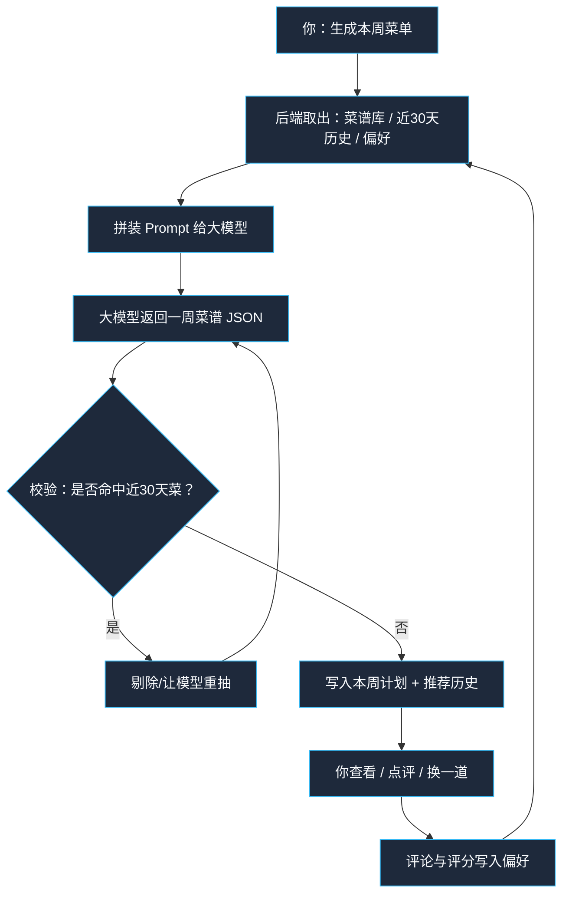
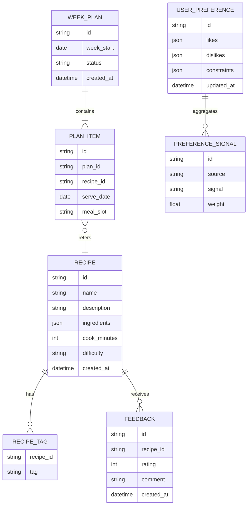
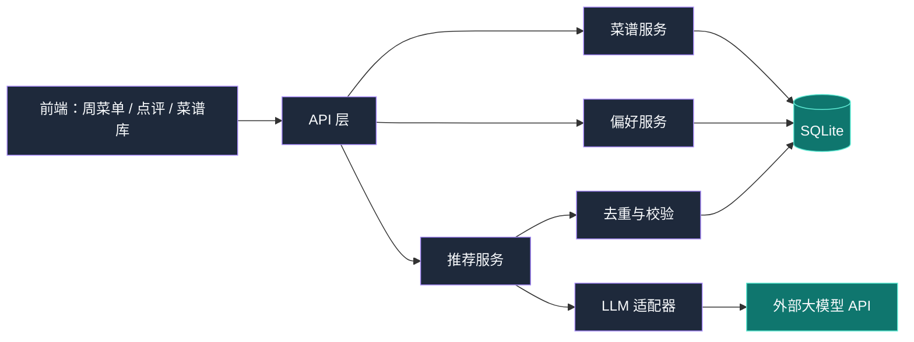
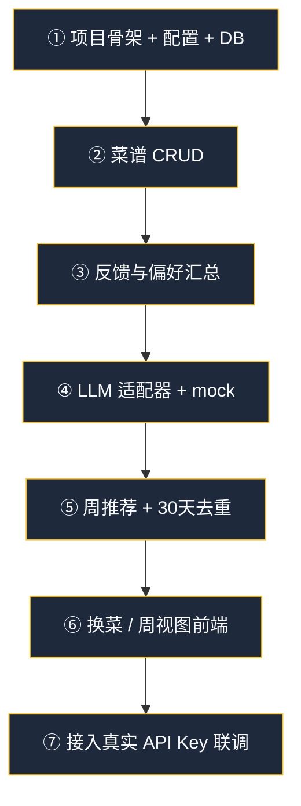

# 每日菜谱推荐 — 项目规划

## 1. 问题理解

你每周不知道吃什么，希望系统：

1. **按周生成菜谱**（一周聚焦一套三餐/晚餐安排）
2. **尽量不重复**：本周出现过的菜，至少 **30 天内不再推荐**
3. **记住口味**：你对每道菜的评论/评分会沉淀成偏好，下次推荐时喂给大模型
4. **持续使用**：菜谱库、历史、偏好都落库，不是一次性对话

一句话：**用「菜谱库 + 推荐历史 + 用户偏好」约束大模型，每周给出不撞车的菜单。**

---

## 2. 核心流程（人话版）



---

## 3. 功能范围（MVP → 后续）

### MVP（先做这些，就能解决「每周吃啥」）

| 模块 | 能力 |
|------|------|
| 菜谱库 | 增删改查菜品（名称、食材、口味标签、难度、耗时） |
| 周计划 | 一键生成「本周 N 天 × 餐次」菜单 |
| 去重 | 近 30 天已推荐菜禁止再次出现（可配置） |
| 点评 | 对菜打分 + 文字评论 → 沉淀偏好 |
| LLM | 接入你提供的 API Base + Key + Model |
| 换菜 | 对某一天某一餐「换一道」，仍遵守去重与偏好 |

### 后续可加（不做进 MVP）

- 购物清单自动汇总
- 营养均衡 / 卡路里目标
- 家庭成员多口味
- 根据冰箱库存推荐
- 微信/飞书提醒

---

## 4. 推荐规则（业务硬约束）

这些规则应在 **后端强制执行**，不能只靠 Prompt「求模型听话」。

1. **冷却期（cooldown）**：同一道菜推荐后，`cooldown_days` 天内不可再推荐（默认 30）
2. **周内不重复**：同一周计划内菜名不重复
3. **偏好加权**：高分/正面评论的菜优先；低分/「太油」「太咸」等标签降权或排除
4. **结构化输出**：模型必须返回可解析 JSON；解析失败则重试（有上限）
5. **候选池优先**：优先从本地菜谱库选；库太小时允许模型 invent 新菜，并回写进库待你确认

---

## 5. 数据模型（最小集）



说明：

- `PLAN_ITEM.meal_slot`：如 `lunch` / `dinner`（MVP 可只做晚餐）
- `USER_PREFERENCE`：可由反馈自动汇总（喜欢辣、讨厌香菜、偏好快手菜等）
- 推荐历史 = 所有已生成的 `PLAN_ITEM`（按 `serve_date` 算 30 天窗口）

---

## 6. 技术架构建议

早期项目，优先 **简单可跑**，避免过度设计。

### 建议栈

| 层 | 选型 | 原因 |
|----|------|------|
| 后端 | Python + FastAPI | 接 LLM、写业务规则快 |
| 数据库 | SQLite（先）→ 可迁 PostgreSQL | 个人项目零运维 |
| ORM | SQLAlchemy / SQLModel | 模型清晰 |
| 前端 | 简单 Web（React 或 Jinja 页面） | 周视图 + 点评即可 |
| LLM | OpenAI 兼容协议 | 你提供 base_url / api_key / model |
| 配置 | `.env` | Key 不进仓库 |

### 模块划分



### 目录草案

```text
daily-recipe/
  backend/
    app/
      main.py
      api/           # routes
      models/        # DB models
      schemas/       # Pydantic
      services/
        recommender.py
        preference.py
        llm_client.py
      core/config.py
    requirements.txt
  frontend/          # 或先用简单模板
  docs/PLAN.md
  .env.example
  README.md
```

---

## 7. LLM 接入方式

你后续提供：

- `LLM_BASE_URL`
- `LLM_API_KEY`
- `LLM_MODEL`

后端用 **OpenAI 兼容 Chat Completions** 调用（多数国产/代理网关都兼容）。

### Prompt 拼装原则

系统提示里固定角色与输出 schema；用户提示里只塞：

1. 本周天数 / 餐次
2. 候选菜列表（或标签摘要）
3. 近 30 天已做菜名单（硬禁止）
4. 偏好摘要（喜欢/讨厌/忌口）
5. 额外约束（如「今晚想吃快手」「这周少油」）

### 输出示例 schema

```json
{
  "week_start": "2026-07-27",
  "items": [
    {
      "date": "2026-07-27",
      "meal_slot": "dinner",
      "recipe_name": "番茄牛腩",
      "reason": "你近期偏好番茄味，且30天内未出现"
    }
  ]
}
```

返回后后端再做：

1. JSON 解析
2. 菜名映射到 `RECIPE.id`（新菜则创建 draft）
3. 冷却期二次校验
4. 落库

---

## 8. 偏好如何「记住」

不是把所有评论原文每次塞给模型，而是分层：

1. **原始反馈**：评分 1–5 + 评论原文
2. **信号抽取**（可规则 + 可选 LLM）：
   - `like:番茄`、`dislike:香菜`、`prefer:30分钟内`、`avoid:重油`
3. **偏好摘要**：定期合并成短文本 / JSON，推荐时注入 Prompt

MVP 可先用规则：评分 ≥4 记喜欢，≤2 记不喜欢；关键词简单抽取。后续再上 LLM 总结。

---

## 9. 关键 API（MVP）

| 方法 | 路径 | 说明 |
|------|------|------|
| GET/POST | `/recipes` | 菜谱列表 / 新增 |
| PATCH/DELETE | `/recipes/{id}` | 更新 / 删除 |
| POST | `/plans/generate` | 生成本周菜单 |
| GET | `/plans/current` | 查看当前周 |
| POST | `/plans/{id}/items/{item_id}/reroll` | 换一道 |
| POST | `/recipes/{id}/feedback` | 点评 |
| GET | `/preferences` | 查看偏好摘要 |
| GET | `/health` | 健康检查 |

---

## 10. 实施步骤（按依赖顺序）



1. **骨架**：FastAPI、配置、SQLite、迁移/建表  
2. **菜谱库**：能录菜、打标签  
3. **反馈**：能点评，生成偏好摘要  
4. **LLM 层**：先 mock，保证链路通；再换真实 Key  
5. **推荐引擎**：生成 → 校验 → 落库  
6. **前端周视图**：看菜单、点评、换菜  
7. **联调**：你提供 API/Key 后接上线

---

## 11. 待你确认的决策

动手写代码前，请确认或调整：

1. **餐次范围**：只推荐晚餐，还是早午晚都要？
2. **冷却天数**：默认 30 天是否 OK？
3. **菜谱来源**：先手工录入一批，还是允许模型直接发明新菜？
4. **前端形态**：要不要简单网页？还是先 API + 文档就行？
5. **技术栈**：是否同意 Python + FastAPI + SQLite？
6. **人数/口味**：目前是否按「一个人」建模即可？

---

## 12. 假定 10 条用例（验收预期）

| # | 输入 | 预期结果 |
|---|------|----------|
| 1 | 库中有 20 道菜，无历史，生成一周 7 顿晚餐 | 返回 7 道不重复菜，全部来自库或合法新菜 |
| 2 | 上周推荐过「宫保鸡丁」，冷却=30 | 本周生成结果中不含「宫保鸡丁」 |
| 3 | 29 天前推荐过 A，今天生成 | A 仍被禁止 |
| 4 | 31 天前推荐过 A，今天生成 | A 可以再次出现 |
| 5 | 用户给「水煮鱼」评 1 分 +「太辣」 | 偏好出现 dislike:辣 / 降权水煮鱼；后续少推或不推 |
| 6 | 用户给「番茄炒蛋」评 5 分 +「家常」 | 偏好 like 提升；后续更易出现同类家常菜 |
| 7 | 对周三晚餐点「换一道」 | 只替换该格；新菜不与本周其他天重复，且遵守 30 天冷却 |
| 8 | LLM 返回非法 JSON | 自动重试；超过次数返回明确错误，不写脏数据 |
| 9 | LLM 返回冷却期内的菜 | 后端校验拦截并重抽/替换，最终结果合规 |
| 10 | 未配置 `LLM_API_KEY` | `/plans/generate` 返回配置错误提示，不崩溃 |

---

## 13. 安全与配置

- API Key 仅放 `.env` / 部署密钥，不进 Git
- 提供 `.env.example` 占位
- 个人单用户 MVP：暂不做复杂登录；本地部署默认信任本机访问

---

## 14. 下一步

确认第 11 节决策后，按第 10 节从 **项目骨架 + 菜谱 CRUD** 开始落地实现。
