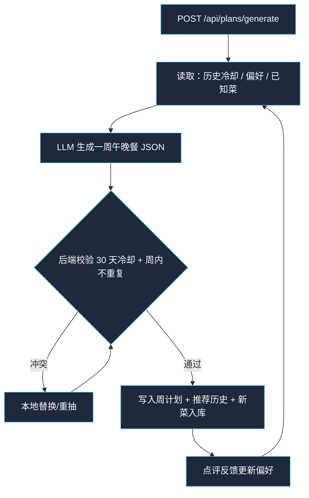
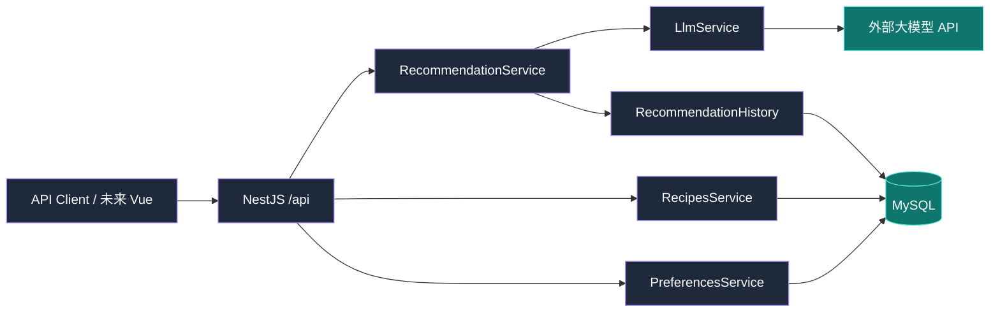

# 每日菜谱推荐 — 项目规划（已确认）

## 已确认决策

| 项 | 结论 |
|----|------|
| 餐次 | **午餐 + 晚餐** |
| 冷却 | **30 天** |
| 菜谱来源 | **允许大模型发明新菜**，自动入库，无需手工录入 |
| 前端 | **先做 API**，Vue 稍后 |
| 技术栈 | **NestJS + Vue + MySQL** |
| 用户 | **单人** |

---

## 1. 问题理解

每周不知道吃什么。系统按周生成午+晚菜单，30 天内不重复，记住点评偏好，持续落库，并接大模型。

---

## 2. 核心流程



---

## 3. MVP 范围

- 周菜单生成（7 天 × lunch/dinner = 14 道）
- 模型可发明新菜并自动入库
- 30 天冷却（独立 `recommendation_histories`，重生菜单不丢历史）
- 换菜、点评、偏好摘要
- OpenAI 兼容 LLM；无 Key 时走 mock，便于本地跑通

后续：Vue 周视图、购物清单、营养目标等。

---

## 4. 技术架构



目录：

```text
backend/          NestJS API（当前）
frontend/         Vue（稍后）
docs/PLAN.md
```

---

## 5. 主要 API

| 方法 | 路径 | 说明 |
|------|------|------|
| GET | `/api/health` | 健康检查 |
| GET/POST | `/api/recipes` | 菜谱列表/可选手工新增 |
| PATCH/DELETE | `/api/recipes/:id` | 更新/删除 |
| POST | `/api/plans/generate` | 生成本周菜单（可传 `weekStart`） |
| GET | `/api/plans/current` | 当前周菜单 |
| GET | `/api/plans/:id` | 指定计划 |
| POST | `/api/plans/:id/items/:itemId/reroll` | 换一道 |
| POST | `/api/recipes/:id/feedback` | 点评 |
| GET | `/api/preferences` | 偏好摘要 |

---

## 6. 环境变量

见 `backend/.env.example`：

- MySQL：`DB_HOST/PORT/USER/PASSWORD/NAME`
- 冷却：`COOLDOWN_DAYS=30`
- LLM：`LLM_BASE_URL` / `LLM_API_KEY` / `LLM_MODEL`

---

## 7. 本地启动

```bash
# MySQL 建库建用户后：
cd backend
cp .env.example .env
npm install
npm run start:dev
```

未配置 `LLM_API_KEY` 时使用本地 mock 菜库生成，链路可完整验证。

---

## 8. 假定 10 条用例

| # | 输入 | 预期 |
|---|------|------|
| 1 | `POST /plans/generate` 无历史 | 返回 14 条（7×午餐晚餐），菜名互不重复 |
| 2 | 同周再次 generate | 新菜单与历史冷却菜不重叠 |
| 3 | 给菜评 5 分 +「好吃家常」 | preferences.likes 含相关信号 |
| 4 | 给菜评 1 分 +「太辣」 | preferences.dislikes 更新 |
| 5 | reroll 某一餐 | 仅该格变化，且不与本周/冷却冲突 |
| 6 | 未配 LLM Key | 走 mock，不 500 |
| 7 | 配了 Key | 走外部 Chat Completions |
| 8 | 模型发明新菜名 | recipes 表自动新增 source=llm |
| 9 | `GET /plans/current` 无计划 | 404 提示先 generate |
| 10 | `GET /health` | `{ ok: true }` |

---

## 9. 下一步

1. 你提供 `LLM_BASE_URL` / `LLM_API_KEY` / `LLM_MODEL` 做真实联调  
2. 再脚手架 Vue 周视图（看菜单 / 换菜 / 点评）
