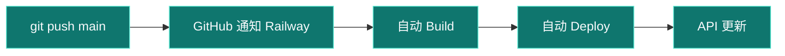

# Railway 部署后端（NestJS + MySQL）

## 你现在这种「2 秒就失败」= 构建目录不对

**Build > Build image** 只跑 2 秒就红，说明 Railway 还没开始 `npm install`，通常是：

- 没找到 `Dockerfile` / `package.json`
- 或 **Root Directory 填错/没生效**

---

## 方案 A（推荐，最简单）：清空 Root Directory

仓库根目录现在有 **`Dockerfile`**，会从 `backend/` 构建，**不用**再设 Root Directory。

### 步骤

1. Railway → 点 **daily-recipe** 服务 → **Settings**
2. 找到 **Root Directory**
3. **删掉里面的内容，留空**（不要填 `backend`，不要填 `/`）
4. **Save**
5. 右上角 **Deployments** → 最新失败记录 → **Redeploy**
6. 或 **Settings** 底部 **Clear build cache** 后再 Deploy

### 成功时 Build 日志应出现

```text
Step 1/... : FROM node:22-alpine
npm ci
npm run build
```

---

## 方案 B：Root Directory = backend

若你想只部署 backend 子目录：

1. **Root Directory** 填：`backend`（无斜杠）
2. 会用 `backend/Dockerfile`
3. **Save** → **Redeploy**

⚠️ 两种方案**二选一**，不要同时乱填。

---

## 其他必查项

### 1. 分支

**Settings → Source → Branch** = `main`（合并后请用 main，不要用旧 feature 分支）

### 2. 环境变量（Variables）——健康检查失败多半是这里没配

后端服务 → **Variables**，至少要有 MySQL（把 `MySQL` 换成你数据库卡片名）：

```env
DB_HOST=${{MySQL.MYSQLHOST}}
DB_PORT=${{MySQL.MYSQLPORT}}
DB_USER=${{MySQL.MYSQLUSER}}
DB_PASSWORD=${{MySQL.MYSQLPASSWORD}}
DB_NAME=${{MySQL.MYSQLDATABASE}}
```

也支持直接写 Railway 自动给的：`MYSQLHOST`、`MYSQLPORT` 等（代码已兼容）。

再加 LLM：

```env
LLM_BASE_URL=https://api.deepseek.com
LLM_API_KEY=你的Key
LLM_MODEL=deepseek-v4-flash
COOLDOWN_DAYS=30
PLAN_DAYS=7
```

> 没配数据库时，服务启动会失败，健康检查 `/api/health` 会一直 **service unavailable**。

### 3. 看 Deploy 日志（不是 Build 日志）

**Deployments → View logs → Deploy** 里若看到：

- `ECONNREFUSED` / `Access denied` → MySQL 变量没配对
- `Failed to start daily-recipe-api` → 把完整错误发我

### 4. 公网域名

**Networking → Generate Domain**

### 5. 自动部署（推代码不用每次手动点）

Railway **可以**在 GitHub 推送后自动构建，不必每次 Redeploy。

**一次性检查：**

1. 服务 **Settings → Source**
   - **Repository**：`quanchenlc/daily-recipe`
   - **Branch**：`main`
2. 改完分支后若卡片显示 **「Edited / 1 Change」**，只需 **点一次 Deploy** 让配置生效
3. 之后每次 `git push` 到 `main`，Railway 会自动开始 Build + Deploy（约 2–5 分钟）



**若推送后没自动部署：**

- Settings → 确认连的是 GitHub（不是只上传 Dockerfile）
- 确认 Branch 是 `main`（不是已删除的旧分支）
- Deployments 页看是否有新记录；没有则 Disconnect 后重新 Connect GitHub

### 6. 验证

```text
https://你的域名.up.railway.app/api/health
```

---

## 还是失败？把日志发我

1. 点 **View logs**
2. 切到 **Build** 标签
3. 复制**最后 30 行**发我

同时发一张 **Settings 里 Root Directory 那一屏**截图。

---

## 常见填错对照

| 你填的 | 结果 |
|--------|------|
| 留空（方案 A） | ✅ 用根目录 Dockerfile |
| `backend`（方案 B） | ✅ 用 backend/Dockerfile |
| `/backend` | ❌ 可能失败 |
| `backend/` | ❌ 可能失败 |
| 没保存就关掉 | ❌ 配置没生效 |
